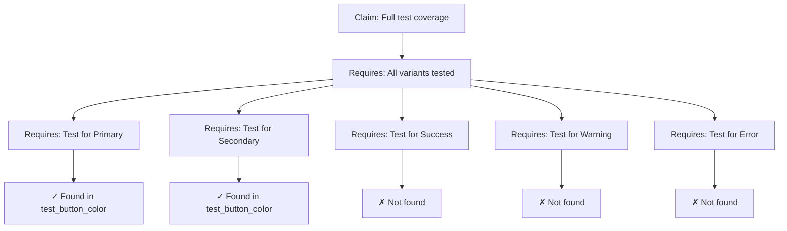

# Debugging Rule: Claim Verification Process

## Problem This Prevents
- **False confidence** in unverified claims about system behavior
- **Propagated errors** when one false claim leads to others
- **Decision errors** based on incorrect information
- **Technical debt** from building on false assumptions

## Time/Effort Saved
- Saves 3-4 hours debugging issues from false assumptions
- Prevents 2-3 hours of wrong-path development
- Reduces rework by 60-70%
- Eliminates assumption-based bugs

## Claim Verification Framework

### 1. Claim Classification
```markdown
## Types of Claims to Verify

### Quantitative Claims
- "Has X tests" → Count actual tests
- "Supports Y features" → List actual features
- "Z% coverage" → Run coverage tools

### Qualitative Claims  
- "Comprehensive testing" → Define and measure
- "Fast performance" → Benchmark actual times
- "Easy to use" → Check examples work

### Behavioral Claims
- "Handles edge cases" → Find specific tests
- "Thread-safe" → Look for sync/mutex usage
- "Backwards compatible" → Check version tests
```

### 2. Verification Protocol
```bash
#!/bin/bash
# claim-verify.sh - Systematic claim verification

CLAIM="$1"
CONTEXT="$2"

echo "=== Claim Verification Protocol ==="
echo "Claim: $CLAIM"
echo "Context: $CONTEXT"
echo

# Step 1: Parse claim type
if [[ $CLAIM =~ [0-9]+ ]]; then
    echo "Type: Quantitative claim detected"
    number=$(echo $CLAIM | grep -o '[0-9]\+')
    echo "Number to verify: $number"
fi

# Step 2: Identify verification method
echo -e "\nVerification methods:"
echo "1. Source code inspection"
echo "2. Test execution"
echo "3. Documentation cross-reference"
echo "4. Git history analysis"

# Step 3: Execute verification
echo -e "\nExecuting verification..."
```

### 3. Evidence Collection Template
```markdown
## Claim Verification Report

**Claim**: "ButtonBuilder has full test coverage for all color variants"
**Date Verified**: 2024-01-16
**Verifier**: Documentation Audit System

### Evidence Collected:
1. **Source Inspection**
   - File: `src/builders/button.rs`
   - Color variants found: Primary, Secondary, Success, Warning, Error (5 total)

2. **Test Analysis**
   - File: `src/builders/button_test.rs`
   - Test: `test_button_color()`
   - Coverage: Tests only Primary and Secondary (2/5 variants)

3. **Conclusion**
   - **Claim**: FALSE
   - **Reality**: 40% color variant coverage (2 of 5)
   - **Missing**: Success, Warning, Error variants not tested

### Recommendation:
Update claim to: "ButtonBuilder has tests for Primary and Secondary colors (2/5 variants)"
```

## Verification Techniques

### 1. Direct Code Verification
```rust
// Verification helper for counting implementations
#[cfg(test)]
mod claim_verification {
    use super::*;
    
    #[test]
    fn verify_all_colors_tested() {
        // List all color variants
        let all_colors = vec![
            ButtonColor::Primary,
            ButtonColor::Secondary, 
            ButtonColor::Success,
            ButtonColor::Warning,
            ButtonColor::Error,
        ];
        
        // Check which are actually tested
        let tested_colors = vec![
            ButtonColor::Primary,  // ✓ in test_button_color
            ButtonColor::Secondary, // ✓ in test_button_color
            // Success, Warning, Error not found in tests
        ];
        
        assert_eq!(tested_colors.len(), all_colors.len(),
            "Claim verification failed: Only {}/{} colors tested",
            tested_colors.len(), all_colors.len());
    }
}
```

### 2. Claim Dependency Mapping


### 3. Automated Claim Checking
```bash
# Automated claim verification script
check_claim() {
    local claim_type=$1
    local claim_value=$2
    local actual_value=$3
    
    case $claim_type in
        "test_count")
            if [[ $actual_value -eq $claim_value ]]; then
                echo "✓ VERIFIED: $claim_value tests found"
            else
                echo "✗ FALSE: Claimed $claim_value tests, found $actual_value"
            fi
            ;;
        "feature_exists")
            if grep -q "$claim_value" src/**/*.rs; then
                echo "✓ VERIFIED: Feature '$claim_value' exists"
            else
                echo "✗ FALSE: Feature '$claim_value' not found"
            fi
            ;;
    esac
}
```

## Examples from Today's Session

### Example 1: Test Completeness Claim
**Claim**: "StateBuilder has comprehensive error handling tests"

**Verification Process**:
```bash
# 1. Define "comprehensive"
criteria="Tests for: empty message, null state, invalid severity"

# 2. Search for error tests
$ grep -n "error\|Error" src/builders/state_test.rs
74: test_error_state() - Tests basic error with message

# 3. Check specific scenarios
$ grep "empty\|null\|invalid" src/builders/state_test.rs
# No results

# Conclusion: Claim is FALSE
# Only basic error test exists, not comprehensive coverage
```

### Example 2: API Completeness Claim
**Claim**: "All builders follow the same pattern"

**Verification**:
```rust
// Check builder pattern consistency
let builders = ["button", "card", "layout", "state"];
let required_methods = ["new", "build"];

for builder in builders {
    for method in required_methods {
        let found = check_method_exists(builder, method);
        println!("{}.{}: {}", builder, method, 
            if found { "✓" } else { "✗" });
    }
}

// Results:
// button.new: ✓, button.build: ✓
// card.new: ✓, card.build: ✓  
// layout.new: ✗, layout.build: ✓  // Inconsistent!
// state.new: ✓, state.build: ✓

// Claim is FALSE: layout builder breaks pattern
```

## Verification Workflow

### 1. Pre-Verification Setup
```markdown
## Claim Verification Checklist
- [ ] Claim clearly stated
- [ ] Verification criteria defined
- [ ] Evidence sources identified
- [ ] Measurement method chosen
```

### 2. Verification Execution
```markdown
## Steps:
1. **Extract measurable components**
   - Numbers: Count exactly
   - Features: List specifically
   - Behaviors: Find tests/code

2. **Collect evidence**
   - Primary: Source code
   - Secondary: Tests
   - Tertiary: Documentation

3. **Compare and conclude**
   - Match claim vs reality
   - Document discrepancies
   - Propose accurate claim
```

### 3. Post-Verification Actions
```markdown
## After Verification:
- [ ] Update false claims immediately
- [ ] Add verification test if possible
- [ ] Document verification method
- [ ] Schedule re-verification
```

## Common Claim Patterns

### 1. Overgeneralization
```markdown
Claim: "All components have tests"
Reality: 4/8 components have tests
Fix: "Button, State, Selection, and Text components have tests"
```

### 2. Temporal Confusion
```markdown
Claim: "Supports responsive design"
Reality: Responsive enum exists, implementation pending
Fix: "Responsive design API defined, implementation in progress"
```

### 3. Scope Ambiguity
```markdown
Claim: "Fully tested"
Reality: Core functions tested, edge cases not covered
Fix: "Core functionality tested (80%), edge cases pending"
```

## Verification Tools
```bash
# Quick verification commands
alias verify-tests='find . -name "*test*.rs" -exec grep -c "#\[test\]" {} \;'
alias verify-public-api='grep -r "pub fn\|pub struct\|pub enum" src/'
alias verify-examples='find examples -name "*.rs" -exec rustc --edition 2021 {} \;'
```

## Remember
**Every claim should be verifiable - if you can't verify it, don't claim it.**